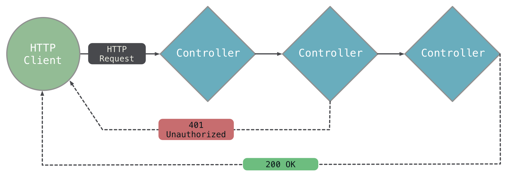
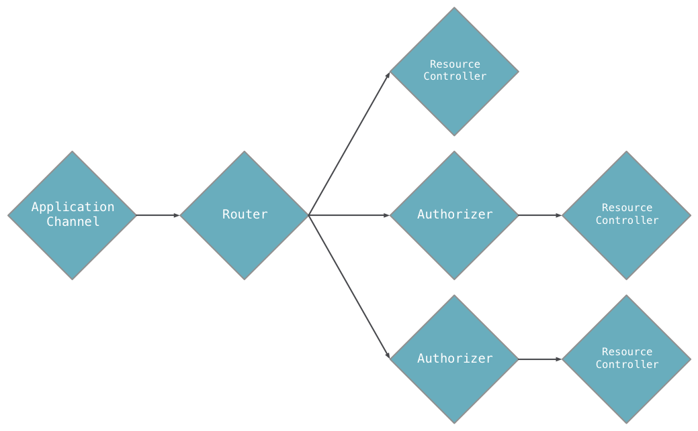

# Application and Project Structure

The purpose of this document is to understand the objects that comprise a Conduit application, and how they work with one another to serve HTTP requests. It also discusses the project structure on the filesystem.

## Controllers are Building Blocks

The building blocks of a Conduit application are [Controllers](../http/controller.md). Each controller type has logic to handle an HTTP request in some way. Controllers are linked together to form a _channel_; an ordered series of controllers. A channel is a composition of its controllers' behaviors.

For example, consider an `Authorizer` controller that verifies the request's authorization credentials are correct, and a `SecretController` that sends a response with secret information. By composing these two controllers together, we have a channel that verifies credentials before sending a secret. The benefit of controllers and channels is that controllers can be reused in multiple channels; the `Authorizer` can protect other types of controllers without any change to its logic.



The last controller in a channel must always respond to a request. These types of controllers are called _endpoint controllers_ and implement the business logic for your application's endpoints. For example, an endpoint controller might fetch a list of books from a database and send them in a response.

The other controllers in a channel are called _middleware controllers_. These types of controllers typically verify something about a request before letting the next controller in the channel handle it. Middleware controllers can respond to a request, but doing so prevents the rest of the controllers in the channel from handling the request.

For example, an "authorization" controller could send a `401 Unauthorized` response protecting the endpoint controller from unauthorized requests. A "caching" controller could send a response with information from a cache, preventing the endpoint controller from performing an expensive query.

Both middleware and endpoint controllers are instances of `Controller` \(or a subclass\). Middleware controllers are typically reusable, while endpoint controllers are typically not. If a middleware controller is not reusable, its logic might be better suited for the endpoint controller it precedes in the channel.

Most endpoint controllers are created by subclassing [ResourceController](../http/resource_controller.md) \(itself a subclass of `Controller`\). This class allows you to implement methods for each HTTP method \(like GET or POST\) for a given endpoint.

## The Application Channel and Entry Point

Each application designates one controller as the _entry point_ of the application. This controller is the first to receive a new request and is the head of the application's channel. In most applications, the entry point is a [Router](../http/routing.md); this controller allows multiple channels to be linked, effectively splitting the channel into sub-channels.



The diagram above looks like this in code:

```dart
class AppChannel extends ApplicationChannel {
  @override
  Controller get entry {
    final router = new Router();

    router
      .route("/a")
      .link(() => new AController());

    router
      .route("/b")
      .link(() => new Authorizer(...))
      .link(() => new BController());

    router
      .route("/c")
      .link(() => new Authorizer(...))
      .link(() => new CController());   

    return router;
  }
}
```

See [this guide](channel.md) for more details on the application channel and entry point.

## Conduit Project Structure and Organization

A Conduit project is a directory that contains, at minimum, the following file structure:

```text
pubspec.yaml
lib/
  application_name.dart
```

The name of any Dart application is defined by the `name` key in `pubspec.yaml`. In order for `conduit serve` to run your application, there must be a `.dart` file in `lib/` with that same name. This is your application library file and it must declare a `ApplicationChannel` subclass or import a file that does. This is the bare minimum requirement to run a Conduit application. \(See [Deploying]() for more details on running applications.\)

For organizing applications of reasonable size, we recommend the following structure:

```text
pubspec.yaml
config.src.yaml
config.yaml
lib/
  application_name.dart
  channel.dart  
  controller/
    user_controller.dart
  model/
    user.dart
test/
  user_controller_test.dart
  harness/
    app.dart
```

The required `pubspec.yaml` and `lib/application_name.dart` files are present alongside a few others:

* `config.yaml`: A [configuration file](configure.md) for the running application.
* `config.src.yaml`: A [template for config.yaml](configure.md).
* `channel.dart`: A file solely for the `ApplicationChannel` of an application. This file should be _exported_ from `application_name.dart`.
* `controller/`: A directory for `Controller` subclass files.
* `model/`: A directory for `ManagedObject<T>` subclass files.
* `test/harness/app.dart`: A [test harness](../testing/tests.md)\) for automated testing.

Feel free to create other subdirectories in `lib/` for organizing other types of files.

## Conduit and dart:io

Conduit runs on top of `dart:io` and relies on its `HttpServer` implementation. When a Conduit application is started, one or more `HttpServer` instances are bound to the port specified by `conduit serve`. For each HTTP request, an instance of `Request` is created to wrap the `HttpRequest` from `dart:io`. The `Request` is added to a `ApplicationChannel`, sending it through the channel of `Controller`s until it is responded to.

In rare circumstances, you may choose to remove a `Request` from the application channel and manipulate the request with `dart:io` only. Once removed, it is your responsibility to respond to the request by setting properties on and closing the `HttpRequest.response`. To take a request out of the channel, simply return `null` from a `Controller`:

```dart
@override
Controller get entryPoint {
  final router = new Router();

  router
    .route("/bypass_conduit")
    .linkFunction((req) async {
      req.response.statusCode = 200;
      req.response.close();

      return null;
    });

  return router;
}
```

This technique is valuable when Conduit can't do something you want it to do or when using [websockets](../http/websockets.md).

